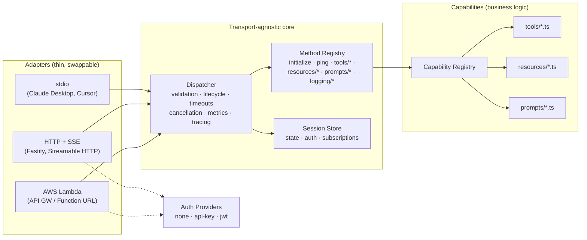

# MCP Server Boilerplate

Production-ready [Model Context Protocol](https://modelcontextprotocol.io) server boilerplate for Node.js + TypeScript. One transport-agnostic core; three deployment targets (stdio, HTTP/SSE, AWS Lambda); capabilities that plug in with a single registration line.

- **Protocol**: MCP spec revision `2025-06-18` (JSON-RPC 2.0), with version negotiation for `2025-03-26` and `2024-11-05`
- **Stack**: Node.js 24 (LTS), TypeScript (strict, ESM), Fastify, Zod 4, Pino, prom-client, jose, undici
- **Ops**: correlation-id logging, Prometheus metrics, OpenTelemetry-ready spans, health checks, rate limiting, request timeouts, cancellation, graceful shutdown
- **Security**: pluggable auth (API key / JWT / none), per-capability scopes, Origin validation, SSRF- and path-traversal-hardened examples, non-root Docker image

## Architecture



**Layering rules** (what keeps this maintainable):

1. **Adapters** translate a medium (stdin lines, HTTP requests, Lambda events) into `dispatcher.handleMessage(message, session)` calls. They contain zero protocol logic.
2. The **dispatcher** owns every cross-cutting concern: JSON-RPC validation, the initialize lifecycle gate, Zod params validation, timeouts, `notifications/cancelled`, metrics, tracing, and error mapping (internals are never leaked to clients).
3. **Method handlers** implement MCP semantics declaratively (`MethodDefinition` = name + Zod schema + handler). A spec change is a new registration, not a refactor.
4. **Capabilities** are pure business logic: `(typed input, context) → result`. They never see JSON-RPC, HTTP, or Lambda.

## Quickstart

Requires **Node.js ≥ 24** (current LTS). With nvm: `nvm use` (picks up `.nvmrc`).

```bash
npm install
cp .env.example .env       # optional — every variable has a safe default

# development (auto-reload)
npm run dev                # HTTP transport on http://127.0.0.1:3000
npm run dev:stdio          # stdio transport (for MCP hosts)

# production
npm run build              # compile to dist/
npm start                  # HTTP transport
npm run start:stdio        # stdio transport

npm test                   # 69 tests: unit + integration + protocol compliance
```

All scripts:

| Script | Purpose |
|---|---|
| `npm run dev` / `dev:stdio` | run from source with auto-reload (tsx) |
| `npm run build` → `npm start` / `start:stdio` | compile & run production build |
| `npm test` / `test:watch` / `coverage` | Vitest suite / watch mode / v8 coverage |
| `npm run typecheck` | `tsc --noEmit` |
| `npm run build:lambda` | bundle `dist/lambda/index.mjs` for AWS Lambda |
| `npm run docker:build` | build the production Docker image |

Smoke-test the HTTP transport:

```bash
curl -s -D - http://127.0.0.1:3000/mcp \
  -H 'content-type: application/json' \
  -d '{"jsonrpc":"2.0","id":1,"method":"initialize","params":{"protocolVersion":"2025-06-18","capabilities":{},"clientInfo":{"name":"curl","version":"1.0"}}}'
# → result + Mcp-Session-Id response header; pass that header on subsequent requests
```

### Claude Desktop / Cursor (stdio)

```jsonc
// claude_desktop_config.json → "mcpServers"
{
  "my-server": {
    "command": "node",
    "args": ["/absolute/path/to/dist/server.js", "--stdio"]
  }
}
```

Run `npm run build` first. In stdio mode all logs go to stderr; stdout is reserved for the protocol.

## Adding capabilities

### A new tool (2 steps)

**1.** Create `src/capabilities/tools/greet.ts`:

```ts
import { z } from 'zod';
import { defineTool } from '../../core/registry/define.js';

export const greetTool = defineTool({
  name: 'greet',
  description: 'Greets a person by name.',
  inputSchema: z.object({
    name: z.string().describe('Who to greet'),
  }),
  // optional: outputSchema, annotations, requiredScopes: ['tools:greet']
  handler: async ({ name }, ctx) => {
    ctx.logger.info({ name }, 'greeting');           // structured server log
    await ctx.reportProgress(1, 1);                  // MCP progress (if requested)
    return { content: [{ type: 'text', text: `Hello, ${name}!` }] };
  },
});
```

**2.** Register it in `src/capabilities/index.ts`:

```ts
registry.registerTool(greetTool);
```

That's it. JSON Schema generation, input validation, `tools/list`, scope enforcement, metrics, tracing, timeout and cancellation handling are all automatic. Handlers get a `CapabilityContext` with `logger`, `config`, `auth`, `session`, `signal` (honor it in long work), `reportProgress()` and `mcpLog()`.

**Error convention**: throw for protocol errors (rare — usually `JsonRpcError.resourceNotFound(...)`), but return `{ isError: true, content: [...] }` for business failures so the calling LLM can read the message and self-correct. Uncaught exceptions are converted to `isError` results automatically and never leak stack traces.

### A new resource

```ts
// fixed URI
defineResource({ uri: 'config://app', name: 'app-config', handler: ... })
// or a template — {var} matches one segment, {+var} matches across "/"
defineResourceTemplate({ uriTemplate: 'db://{table}/{id}', name: 'record', handler: ... })
```

Subscribable resources push updates: call `appContext.notifyResourceUpdated(uri)` from your business logic and every subscribed client receives `notifications/resources/updated`.

### A new prompt

```ts
definePrompt({
  name: 'summarize',
  argumentsSchema: z.object({ text: z.string().describe('Text to summarize') }),
  handler: ({ text }) => ({ messages: [{ role: 'user', content: { type: 'text', text: `Summarize:\n${text}` } }] }),
})
```

Zod optionality/descriptions project automatically into the spec's `arguments` list.

### A new protocol method or transport

- **Method**: write a `MethodDefinition` and register it via `createAppContext({ registerMethods })` or in `src/core/methods/index.ts`.
- **Transport**: implement ~100 lines that (1) authenticate → `AuthContext`, (2) obtain a `Session`, (3) call `dispatcher.handleMessage`, (4) deliver responses & wire `session.setSender` for push. See `src/adapters/stdio.ts` for the minimal example.

## Authentication & authorization

| Mode | Config | Behavior |
|---|---|---|
| `none` (default) | — | anonymous principal with wildcard scope; for local/trusted use |
| `api-key` | `API_KEYS=key:scopeA\|scopeB,key2` | `x-api-key` header or bearer token; constant-time comparison; per-key scopes |
| `jwt` | `JWT_SECRET` or `JWT_JWKS_URL` (+ optional `JWT_ISSUER`, `JWT_AUDIENCE`) | `Authorization: Bearer`; scopes from `scope`/`scopes` claims |

Authentication runs at the transport edge (HTTP 401 before any JSON-RPC processing). Authorization is per-capability: declare `requiredScopes: ['tools:fetch']` on any tool/resource/prompt and the dispatcher answers `-32003` for under-scoped principals. Sessions are bound to the authenticating principal.

To add a scheme (OAuth2 introspection, mTLS, ...): implement the 2-method `AuthProvider` interface in `src/auth/providers/`, add a case in `createAuthProvider` — no core or transport changes.

## Deployment

### Docker

```bash
docker build -f docker/Dockerfile -t mcp-server .
docker run --rm -p 3000:3000 -e AUTH_MODE=api-key -e API_KEYS=prod-key:* mcp-server
# or: docker compose up --build
```

Multi-stage build, production deps only, non-root user, tini as PID 1 (so SIGTERM → graceful shutdown works under K8s/ECS), `HEALTHCHECK` on `/healthz`. Point liveness at `/healthz`, readiness at `/readyz`.

### AWS Lambda (SAM)

```bash
sam build && sam deploy --guided     # uses template.yaml (esbuild, nodejs24.x, arm64)
```

Or bundle yourself (`npm run build:lambda` → `dist/lambda/index.mjs`, single file) and deploy with any tool — the handler is `src/lambda-handler.handler`, compatible with API Gateway HTTP APIs (payload v2) and Function URLs.

Lambda runs in **stateless mode** (forced): each request gets an ephemeral, pre-initialized session. Trade-offs, per MCP's design: no SSE stream, so no subscriptions/server-push — use the container deployment when you need those. Prefer API Gateway throttling + WAF over in-process rate limiting there.

### Kubernetes/ECS notes

Session state is in-memory by default, so use session affinity — or implement the 5-method `SessionStore` interface (`src/core/session.ts`) over Redis/DynamoDB and inject it via `createAppContext({ sessionStore })`.

## Configuration

All configuration is environment variables, validated by Zod at startup (invalid config = refusal to boot with a readable report). See **`.env.example`** for the full annotated reference. Highlights:

| Variable | Default | Purpose |
|---|---|---|
| `MCP_TRANSPORT` | `http` | `http` or `stdio` (CLI `--stdio` overrides) |
| `HTTP_HOST` / `HTTP_PORT` | `127.0.0.1` / `3000` | bind address |
| `ALLOWED_ORIGINS` | *(empty)* | CORS + DNS-rebinding allowlist; empty = localhost-only origins |
| `AUTH_MODE` | `none` | `none` \| `api-key` \| `jwt` |
| `STATELESS` | `false` | ephemeral sessions (Lambda) |
| `REQUEST_TIMEOUT_MS` | `30000` | per-request deadline enforced by the dispatcher |
| `RATE_LIMIT_*` | enabled, 120/min | HTTP rate limiting |
| `SESSION_TTL_MS` | `1800000` | idle session eviction |

## Observability

- **Logs**: Pino JSON to stdout (stderr for stdio). Every line carries the request-scoped correlation id (`x-request-id` header, Lambda request id, or generated), session id and method via AsyncLocalStorage — no manual threading. Credentials are redacted.
- **Metrics**: `GET /metrics` (Prometheus). `mcp_rpc_requests_total{method,status}`, `mcp_rpc_request_duration_seconds`, `mcp_tool_calls_total{tool,outcome}`, `mcp_active_sessions`, plus Node.js default metrics.
- **Tracing**: spans (`mcp.rpc <method>`, `mcp.tool.call`) are emitted through `@opentelemetry/api`, which is a no-op until you register an SDK:

```ts
// e.g. instrumentation.ts, loaded before the server via --import
import { NodeSDK } from '@opentelemetry/sdk-node';
new NodeSDK({ /* exporter config */ }).start();
```

- **Health**: `/healthz` (liveness), `/readyz` (readiness — extend with real dependency checks).

## Testing

```bash
npm test             # vitest run
npm run coverage     # v8 coverage
npm run typecheck
```

`tests/helpers/mcp-test-client.ts` is a protocol-compliance harness: it drives the real dispatcher exactly like a transport does (`initialize()` handshake, `request`, `requestExpectError`, `notify`). Use it to spec-test every capability you add without booting a server. Integration tests exercise the full Fastify transport via `inject` (no sockets), the stdio transport via in-memory streams, and the Lambda adapter via synthetic API Gateway events.

## Project structure

```
src/
├── core/                    # transport-agnostic protocol engine
│   ├── jsonrpc/             #   JSON-RPC 2.0 types, errors, parsing
│   ├── protocol/            #   MCP wire types + version negotiation
│   ├── methods/             #   declarative method registry (initialize, tools/*, ...)
│   ├── registry/            #   capability registry + defineTool/Resource/Prompt
│   ├── dispatcher.ts        #   validation · lifecycle · timeouts · cancellation
│   ├── session.ts           #   sessions + pluggable SessionStore
│   ├── subscriptions.ts     #   resource subscription fan-out
│   └── container.ts         #   composition root (DI)
├── capabilities/            # YOUR business logic (examples included)
│   ├── tools/               #   calculator (sync), fetch-url (async, scoped, SSRF-guarded)
│   ├── resources/           #   system-info (subscribable), docs (template, sandboxed)
│   └── prompts/             #   code-review
├── adapters/                # stdio.ts · http.ts · lambda.ts
├── auth/                    # AuthProvider interface + none/api-key/jwt
├── config/                  # Zod-validated env config
├── observability/           # logger · metrics · tracing · request-context
├── utils/                   # graceful shutdown
├── server.ts                # HTTP/stdio entry point
└── lambda-handler.ts        # Lambda entry point
tests/                       # unit + integration + protocol helpers
docker/Dockerfile            # multi-stage, non-root, healthcheck
template.yaml                # AWS SAM (Lambda + API Gateway)
```

## Design decisions worth knowing

- **Hand-rolled protocol core** (vs. wrapping an SDK): the dispatcher/method-registry split keeps the core deployable anywhere a JSON message can arrive, makes spec revisions an additive change, and keeps Lambda cold starts lean. Protocol types live in exactly one place (`src/core/protocol/`).
- **Composition-root DI** (vs. tsyringe): no decorators/`reflect-metadata` in ESM, the object graph is explicit, and tests override any node of it.
- **Tool errors are results** (`isError: true`), protocol errors are JSON-RPC errors — per spec, so LLMs can observe tool failures.
- **JSON-RPC batching is rejected** (removed in spec `2025-06-18`).
- **Sessions**: HTTP uses `Mcp-Session-Id` + TTL eviction; expired/unknown ids return 404 so well-behaved clients silently re-initialize.
